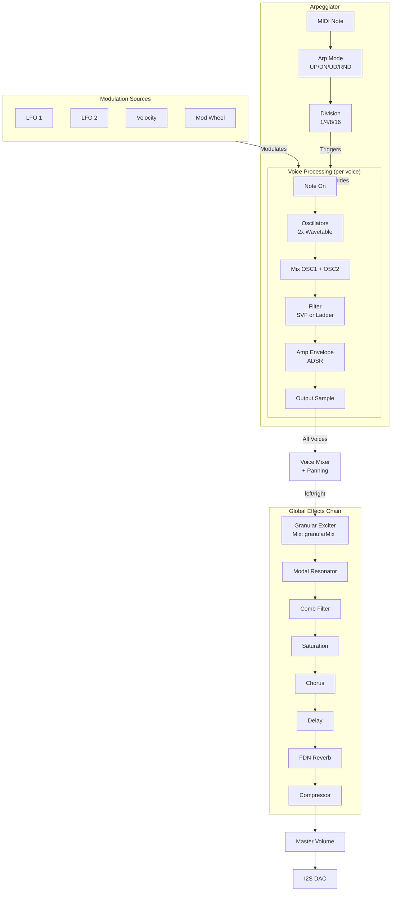

# Signal Flow Diagram

## Detailed Signal Path

### 1. Voice Processing (per note)
1. **Note On** → Allocates voice, sets note/velocity
2. **Oscillators** → 2x wavetable oscillators (SAW, SQUARE, SINE, TRIANGLE, PULSE, SUPERSAW, NOISE)
3. **Mix** → Blends OSC1 + OSC2 based on oscMix parameter
4. **Filter** → SVF (LP/HP/BP/Notch) or Moog Ladder (LP6/12/18/24, BP, HP)
5. **Amp Envelope** → ADSR envelope applied to amplitude
6. **Output** → Single sample per voice

### 2. Modulation Sources
- **LFO 1** → Typically routed to Filter Cutoff
- **LFO 2** → Available for any destination
- **Velocity** → Scales filter envelope amount, amp level
- **Mod Wheel** → Available via ModMatrix

### 3. Voice Mixing
- All active voices summed with individual panning
- Global pan spread applied
- Mixed to mono/stereo

### 4. Global Effects Chain (in order)
1. **Granular Exciter** → Optional; mixes with voice signal (granularMix_ parameter)
2. **Modal Resonator** → Optional; bank of resonant filters
3. **Comb Filter** → Optional; Karplus-Strong inspired
4. **Saturation** → Soft clipping waveshaper
5. **Chorus** → Stereo modulation effect
6. **Delay** → Feedback delay with tempo sync
7. **FDN Reverb** → 4x4 feedback delay network
8. **Compressor** → Dynamic range reduction
9. **Master Volume** → Final gain control

### 5. Output
- I2S DAC output (16-bit, 48kHz)

---

## Key Observations

1. **Granular is in series** — Mixed with voice signal, not a separate layer
2. **Resonator is in series** — After granular, affects entire mix
3. **FDN Reverb is a send/insert hybrid** — Processes mono input but outputs stereo
4. **All effects are globally applied** — No per-voice effect chains

## Modulation Routing

| Source | Default Destination |
|--------|-------------------|
| LFO 1 | Filter Cutoff |
| LFO 2 | (Available) |
| Velocity | Filter Env Amount, Amp Level |
| Mod Wheel | (Available via ModMatrix) |

---

*Generated: April 2026*
*ESPSynth Resonant Spectral Engine*